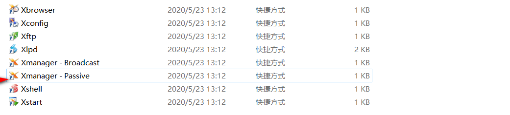
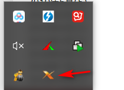
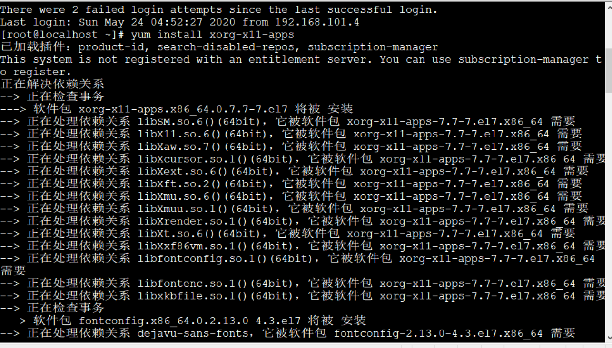
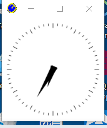

# 在Linux下，使用Xmanager图形化显示

linux在安装Oracle时，需要图形化展示，本博客将使用xclock显示钟表进行测试

首先需要下载Xmanager网址：http://www.xshellcn.com/

安装之后

打开之后，点击tools里面的Xmanager - Passive



然后在右下角出现这个图标即可，后面的0.0后面会用到。



首先进行安装
```
yum install xorg-x11-apps
```



然后输入
```
export DISPLAY=192.168.101.23:0.0
```
在输入
```
xclock
```
这个时候出现弹窗，点击是即可

然后出现结果，完成！


