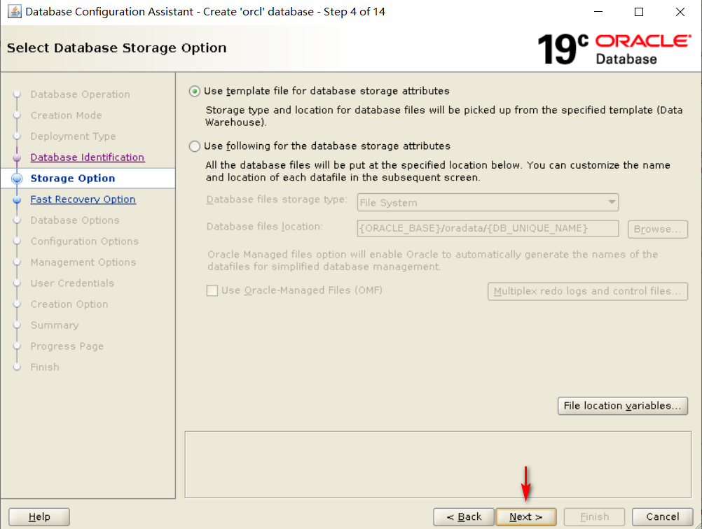

# Linux下创建Oracle19C的数据库实例

## 创建监听器
然后进入到Oracle用户下db_1目录，执行命令
```
[oracle@localhost db_1]$ export DISPLAY=192.168.101.1:0.0
[oracle@localhost db_1]$ LANG=en_US netca
```
弹出框之后点击是，然后出现页面：


## 创建数据库实例
然后输入下面的命令，开始创建一个数据库的实例
```
[oracle@localhost db_1]$ export DISPLAY=192.168.101.1:0.0
[oracle@localhost db_1]$ LANG=en_US dbca
```





（此处的密码是小写字母加数字加大写字母，注意长度不要太长）


等待创建数据库完成即可

创建完成之后，启动数据库：