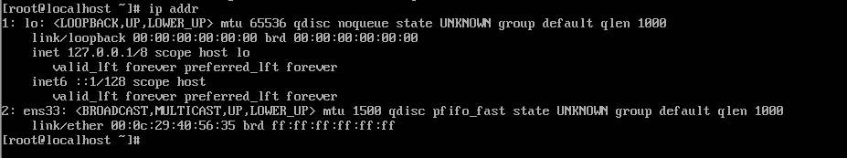
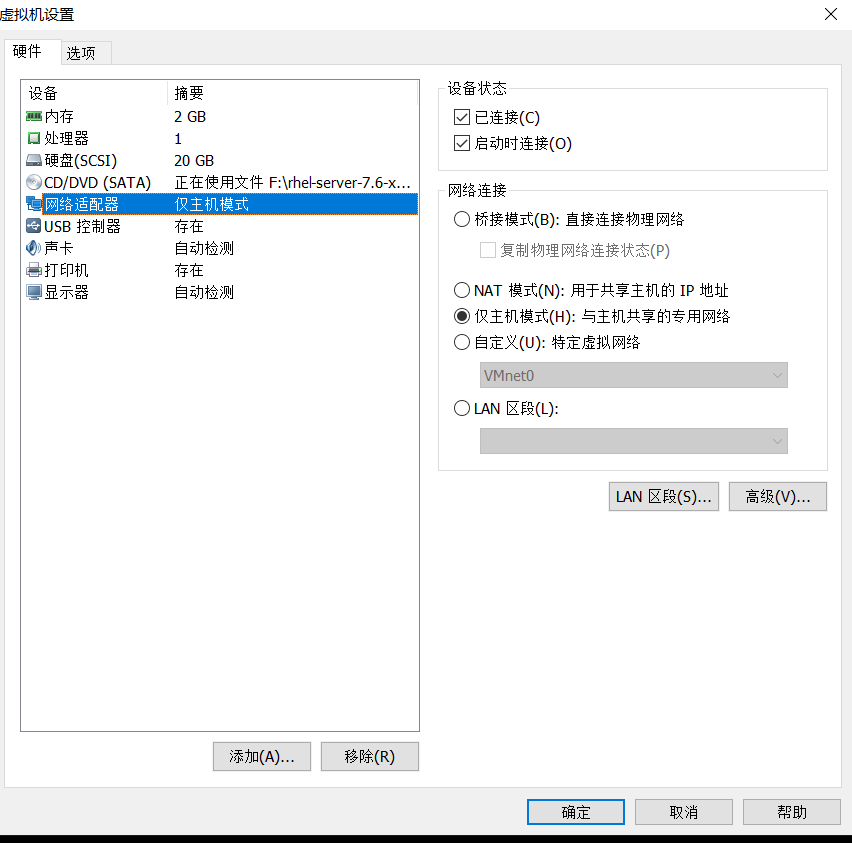
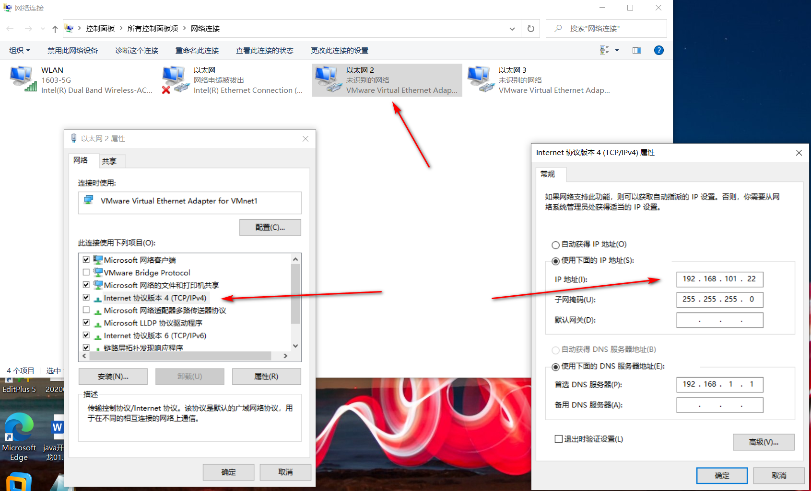
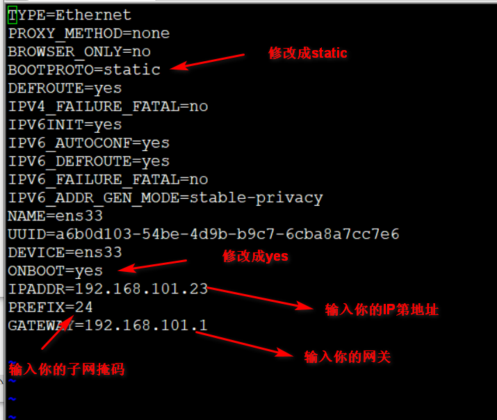

# IP 配置


我们开始配置IP地址，配置IP地址很重要，可以用来连接XSHELL还有XFTP，也可以用Xmanager进行图形化显示

首先，我们运行虚拟机，输入IP addr，显示的是当前的IP




然后打开VMware，点击相应虚拟机的设置，点击网络：



然后点击确认即可。然后打开网络设置，系统默认为VMware分配的IPV4的地址，记住，这个地址将作为虚拟机的网关



虚拟机的IP地址设置一个与网关相同网段的IP地址

 首先我们先进入到IP地址配置的文件：  
 ```vi /etc/sysconfig/network-scripts/ifcfg-enp0s3```  
 (文件名可能会有差异)  
 修改：
 ```
BOOTPROTO=static

ONBOOT=yes
```
（IP地址还有网关要根据你自己的电脑来进行设置）



修改完毕之后，esc,然后：wq,保存退出

然后输入
```shell
 service network restart
```
 重启网卡，修改成功