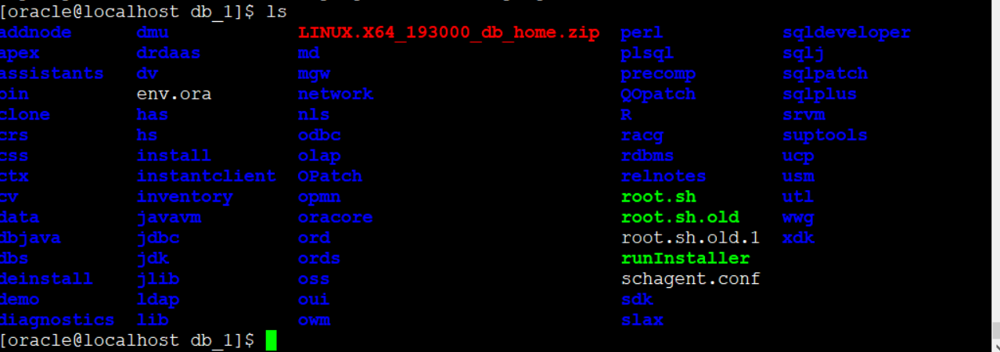
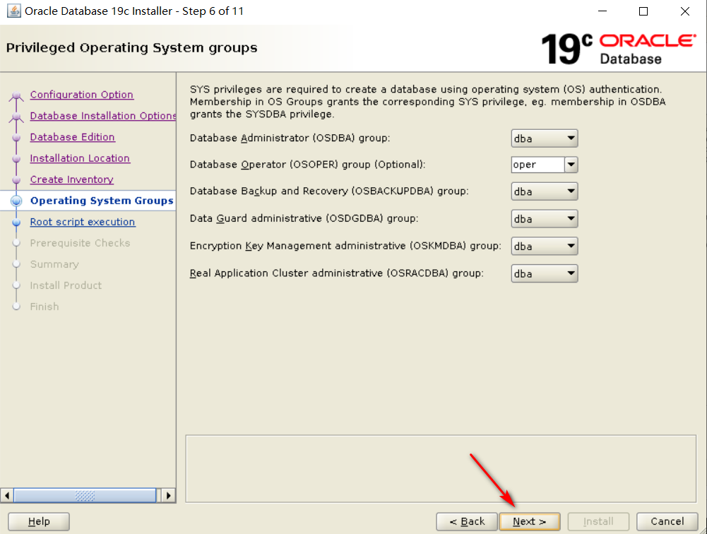

# redhat7.6Linux安装Oracle19C完整版教程

Oracle19C的安装包下载：https://www.oracle.com/technetwork/database/enterprise-edition/downloads/index.html 需要先行自己注册一个账号。

下载完之后的压缩包


接下来，咱们开始进入正题，哈哈(会出配置变量脚本 19c.sh)

## 1创建组和用户
```
/usr/sbin/groupadd -g 54321 oinstall
/usr/sbin/groupadd -g 54322 dba
/usr/sbin/groupadd -g 54323 oper
/usr/sbin/useradd -u 54321 -g oinstall -G dba,oper oracle
```
结果


## 2修改用户密码：
```
[root@localhost ~]# passwd oracle
```


## 3关闭防火墙还有selinux

防火墙
```
systemctl stop firewalld.service

systemctl disable firewalld.service
```
selinux
```
cat /etc/selinux/config
```
查看状态


## 4创建工作的目录，然后赋予相应的权限。
 
 ```
mkdir -p /u01/app/oracle/product/19.2.0/db_1

chown -R oracle:oinstall /u01/

chmod -R 775 /u01/
```
## 5配置Oracle的环境变量
首先
```
su - oracle
```


输入
```
vi .bash_profile
```
在，编辑模式下输入
```
ORACLE_SID=sanshi;export ORACLE_SID
ORACLE_UNQNAME=sanshi;export ORACLE_UNQNAME
ORACLE_BASE=/u01/app/oracle; export ORACLE_BASE
ORACLE_HOME=$ORACLE_BASE/product/19.2.0/db_1; export ORACLE_HOME
NLS_DATE_FORMAT="YYYY:MM:DDHH24:MI:SS"; export NLS_DATE_FORMAT
NLS_LANG=american_america.ZHS16GBK; export NLS_LANG
TNS_ADMIN=$ORACLE_HOME/network/admin; export TNS_ADMIN
ORA_NLS11=$ORACLE_HOME/nls/data; export ORA_NLS11
PATH=.:${JAVA_HOME}/bin:${PATH}:$HOME/bin:$ORACLE_HOME/bin:$ORA_CRS_HOME/bin
PATH=${PATH}:/usr/bin:/bin:/usr/bin/X11:/usr/local/bin
export PATH
LD_LIBRARY_PATH=$ORACLE_HOME/lib
LD_LIBRARY_PATH=${LD_LIBRARY_PATH}:$ORACLE_HOME/oracm/lib
LD_LIBRARY_PATH=${LD_LIBRARY_PATH}:/lib:/usr/lib:/usr/local/lib
export LD_LIBRARY_PATH
CLASSPATH=$ORACLE_HOME/JRE
CLASSPATH=${CLASSPATH}:$ORACLE_HOME/jlib
CLASSPATH=${CLASSPATH}:$ORACLE_HOME/rdbms/jlib
CLASSPATH=${CLASSPATH}:$ORACLE_HOME/network/jlib
export CLASSPATH
THREADS_FLAG=native; export THREADS_FLAG
export TEMP=/tmp
export TMPDIR=/tmp
umask 022
```
保存之后退出。

## 6修改内核参数
首先退出到root用户，然后输入
```
vi /etc/sysctl.conf
```
编辑模式下，输入相关的变量
```
fs.file-max = 6815744
kernel.sem = 250 32000 100 128
kernel.shmmni = 4096
kernel.shmall = 1073741824
kernel.shmmax = 4398046511104
kernel.panic_on_oops = 1
net.core.rmem_default = 262144
net.core.rmem_max = 4194304
net.core.wmem_default = 262144
net.core.wmem_max = 1048576
fs.aio-max-nr = 1048576
net.ipv4.ip_local_port_range = 9000 65500
```


然后输入
```
sysctl --system
```
生效


## 7下面开始安装一些重要的包
```
yum install bc gcc gcc-c++ binutils compat-libcap1 compat-libstdc++ dtrace-modules dtrace-modules-headers dtrace-modules-provider-headers dtrace-utils elfutils-libelf elfutils-libelf-devel fontconfig-devel glibc glibc-develksh libaio libaio-devel libdtrace-ctf-devel libX11 libXau libXi libXtst libXrender libXrender-devel libgcc librdmacm-devel libstdc++ libstdc++-devel libxcb make smartmontools sysstat
```
把，这句话直接复制到命令行窗口即可，如果失败的话，请参考该Redhat7.6Linux本地的yum源配置


## 8安装包完成之后，将Windows的压缩包上传


然后输入命令解压压缩包，首先先安装这个解压工具，进入到Oracle用户下解压文件(解压时间较长，耐心等待。。。。。。)
```
yum -y install zip unzip
su - oracle
unzip LINUX.X64_193000_db_home.zip -d /u01/app/oracle/product/19.2.0/db_1/
```
解压完成之后的目录结构如图所示



## 9接下来开始最后一步 ，图形安装Oracle数据库啦

 在Oracle用户下
 ```
[oracle@localhost db_1]$ export DISPLAY=192.168.101.1:0.0
[oracle@localhost db_1]$ LANG=en_US ./runInstaller
```
就会打开图形化安装界面，弹出框点击是





然后等待安装成功。


切换root用户执行上图的脚本


遇到输入，直接回车即可！！
然后返回oracle安装界面，再点击OK


安装成功之后，创建数据库实例