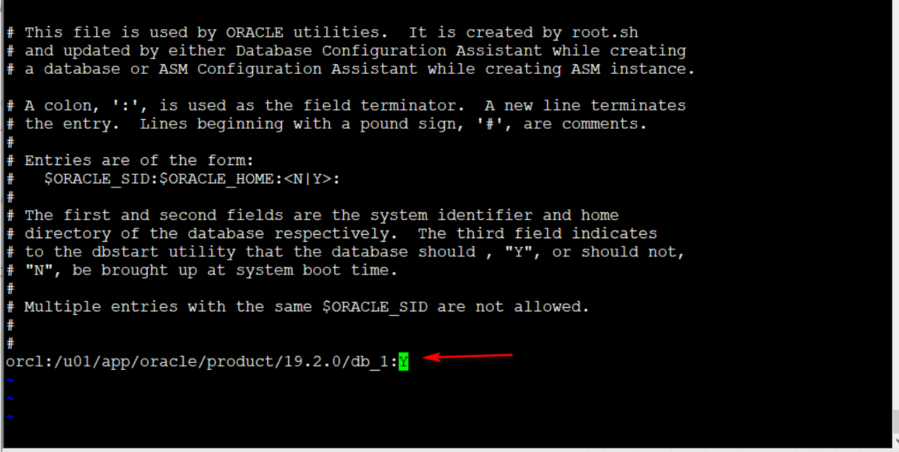

# 配置环境变量

## 环境变量设置及启动

切换root用户，在服务器上配置环境变量，编辑
```
[root@localhost db_1]# vi /etc/profile
```
在末尾加入以下配置
```
export ORACLE_HOME=/u01/app/oracle/product/19.2.0/db_1
export PATH=$ORACLE_HOME/bin:$PATH
export ORACLE_SID=ORCL
重新加载profile文件
[root@localhost db_1]# source /etc/profile
```


```
vi /etc/oratab
```
最后的N改成Y(否则dbstart和dbshut)



手动启动或者在linux命令行执行命令
```
开启 dbstart $ORACLE_HOME
关闭 dbshut $ORACLE_HOME


```
设置开启启动项
su root 切换root用户
```
cd /etc/rc.d 到指定目录中
[root@localhost rc.d]# vi rc.local 
```
在文件末尾追加配置
```
su - oracle -c lsnrctl start
su - oracle -c dbstart $ORACLE_HOME
```


