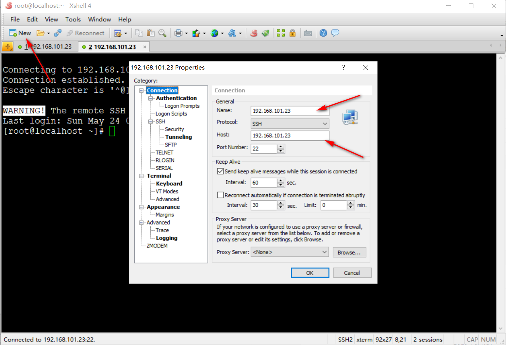
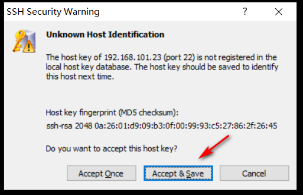
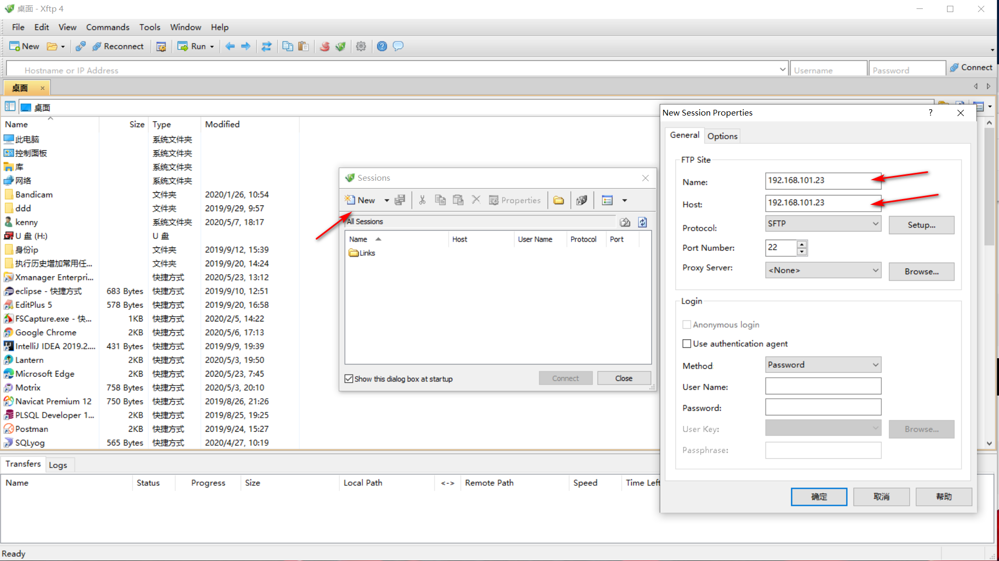
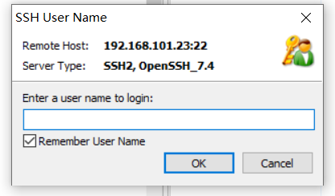
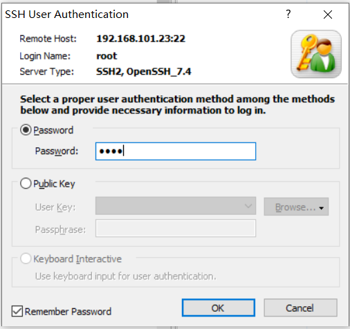
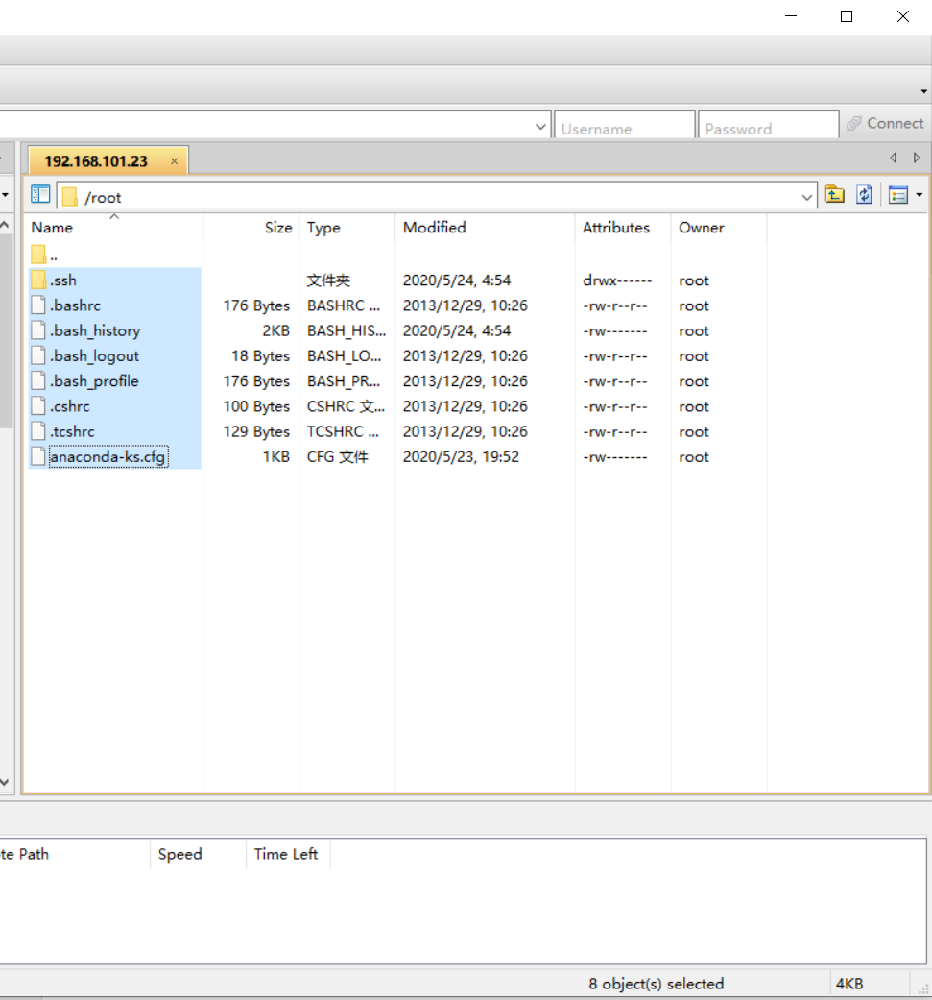

# xshell和Xftp连接虚拟机

xshell和Xftp下载请到官网http://www.xshellcn.com/

安装完成之后，点击打开Xshell

选择新建连接，之后输入名称，还有之前设置好的IP地址

连接成功！  
然后使用Xftp也是大同小异

就可以在外部使用命令操作Linux系统了

Xshell里面的复制是ctrl+insert.粘贴是shift+insert
