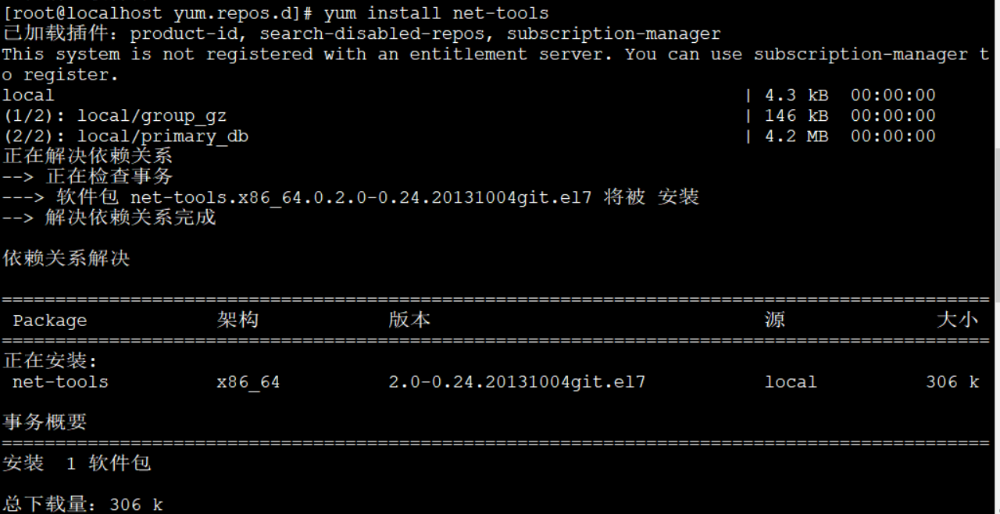

# Redhat7.6Linux本地的yum源配置

首先，个人的建议呢是配置本地的yum源，这样简单快捷

我们先挂载iOS镜像,然后在Xshell，输入
```
mount /dev/cdrom /mnt
```


将盘片挂载上来，输入

```
cd /etc/yum.repos.d
```
 输入ls,查看其中的文件，如果有redhat.repo，使用vi命令编辑此文件，然后将其中的内容全部删除。输入
```
vi redhat-base.repo
```
然后在其中编辑处输入（第一行中括号里面的内容必须有，是一个标签）
```
[local]
name=Red Hat Enterprise Linux 6.7
baseurl=file:///mnt
enabled=1
gpgcheck=1
gpgkey=file:///mnt/RPM-GPG-KEY-redhat-release
```
然后esc,:wq,保存这个新建的文件输入  
```
yum clean all
```


测试一下输入
```
yum install net-tools
```



至此，本地yum源，配置完毕